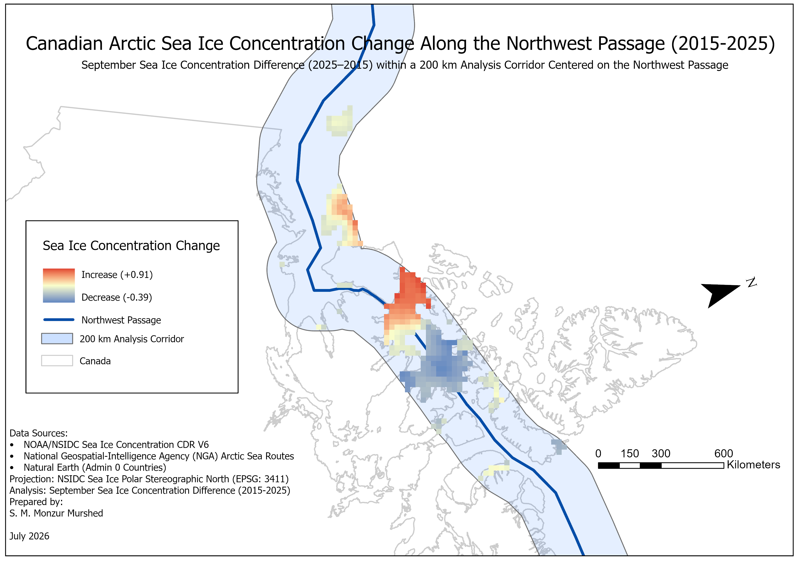

# Canadian Arctic Sea Ice Concentration Change Along the Northwest Passage (2015–2025)


[](maps/Canadian_Arctic_Sea_Ice_Concentration_Change_2015_2025.pdf)

---

## Table of Contents

- [Project Overview](#project-overview)
- [Objectives](#objectives)
- [Study Area](#study-area)
- [Data Sources](#data-sources)
- [Workflow](#workflow)
- [Software](#software)
- [Methodology](#methodology)
- [Results](#results)
- [Key Findings](#key-findings)
- [Project Structure](#project-structure)
- [Skills Demonstrated](#skills-demonstrated)
- [Future Improvements](#future-improvements)
- [License](#license)
- [Contact](#contact)

---

## Project Overview

This project analyzes changes in September sea ice concentration along the Canadian Northwest Passage between 2015 and 2025. Using NOAA/NSIDC Climate Data Records (CDR), GIS techniques, and ArcGIS Pro, the analysis identifies where sea ice concentration increased or decreased within a 200 km analysis corridor centered on the Northwest Passage.

The project demonstrates raster processing, spatial analysis, cartographic design, and geospatial workflow documentation using ArcGIS Pro.

---

## Objectives

- Analyze September sea ice concentration changes between 2015 and 2025.
- Focus the analysis on the Canadian Northwest Passage shipping corridor.
- Identify areas where sea ice concentration increased or decreased.
- Produce a publication-quality thematic map suitable for scientific communication.

---

## Study Area

The study area covers the Canadian Arctic Archipelago and the Northwest Passage shipping route. A 200 km buffer surrounding the shipping corridor was created to examine sea ice conditions directly affecting navigation.

---

## Data Sources

| Dataset                             | Source                                        |
| ----------------------------------- | --------------------------------------------- |
| Sea Ice Concentration CDR Version 6 | NOAA / NSIDC                                  |
| Arctic Sea Routes                   | National Geospatial-Intelligence Agency (NGA) |
| Admin 0 Countries                   | Natural Earth                                 |

---

## Workflow

1. Download NOAA/NSIDC sea ice rasters
2. Prepare Arctic shipping routes
3. Calculate raster difference (2025 − 2015)
4. Create 200 km analysis corridor
5. Extract raster using corridor mask
6. Design final map layout

---

## Software

| Software        | Purpose                                  |
| --------------- | ---------------------------------------- |
| ArcGIS Pro      | GIS analysis and cartographic production |
| Spatial Analyst | Raster analysis and Extract by Mask      |
| ModelBuilder    | Workflow automation                      |

---

## Methodology

### 1. Data Preparation

- Imported September 2015 and September 2025 sea ice concentration rasters.
- Converted rasters into the project geodatabase.
- Verified both datasets used the same coordinate system (NSIDC Sea Ice Polar Stereographic North, EPSG:3411).

### 2. Raster Analysis

A raster difference layer was created using Raster Calculator:

```
SeaIce2025 - SeaIce2015
```

Positive values indicate an increase in sea ice concentration, while negative values indicate a decrease.

### 3. Corridor Creation

- Imported the Northwest Passage shipping route.
- Selected the Northwest Passage from the Arctic shipping routes dataset.
- Exported it as an individual feature class.
- Generated a 200 km buffer around the route.

### 4. Extract by Mask

The raster difference was clipped using the corridor buffer with the **Extract by Mask** tool to focus analysis on sea ice changes affecting navigation.

### 5. Cartographic Design

The final map includes:

- Diverging blue–white–red color scheme
- Canada boundary
- Northwest Passage route
- 200 km analysis corridor
- Legend
- North arrow
- Scale bar
- Metadata and data sources

---

## Results

The analysis reveals localized increases and decreases in September sea ice concentration along portions of the Northwest Passage between 2015 and 2025.

The majority of significant changes occur within the central Canadian Arctic Archipelago, demonstrating the spatial variability of sea ice conditions that may influence Arctic shipping accessibility.

---

## Key Findings

- Sea ice concentration changes are spatially heterogeneous along the Northwest Passage.
- The largest positive changes occur within portions of the central Canadian Arctic Archipelago.
- Areas of decreasing sea ice concentration may indicate improved seasonal shipping accessibility.
- The analysis demonstrates how GIS can support climate and Arctic transportation studies.

---

## Project Structure

```

Canadian-Arctic-Sea-Ice-Shipping-Analysis/
│
├── data/            Source data documentation
├── maps/            Final maps
├── modelbuilder/    ArcGIS ModelBuilder workflow
├── report/          Technical report
├── screenshots/     Workflow screenshots
├── scripts/         Python scripts
└── README.md

```

---

## Skills Demonstrated

### GIS & Remote Sensing

- Raster Processing
- Spatial Analysis
- Buffer Analysis
- Extract by Mask
- Raster Calculator

### Cartography

- Map Design
- Data Visualization
- Legend Design
- Map Layout

### GIS Management

- ArcGIS Pro
- Geodatabase Management
- Coordinate Systems
- ModelBuilder

---

## Future Improvements

Potential future enhancements include:

- Multi-year sea ice trend analysis (2000–2025)
- Seasonal comparison (March vs. September)
- Integration of Automatic Identification System (AIS) vessel traffic
- Shipping route accessibility modelling
- Climate change impact visualization
- Publication as an ArcGIS StoryMap

---

## License

This project is available under the MIT License.

---

## Contact

**S. M. Monzur Murshed**

- [LinkedIn](https://www.linkedin.com/in/monzur-murshed-84576317/)
- [GitHub](https://github.com/MonzurMurshed)
