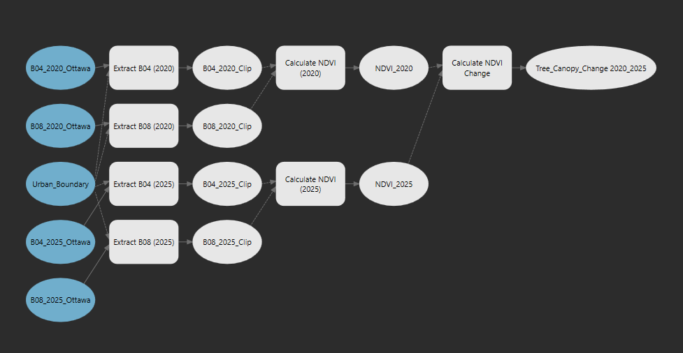
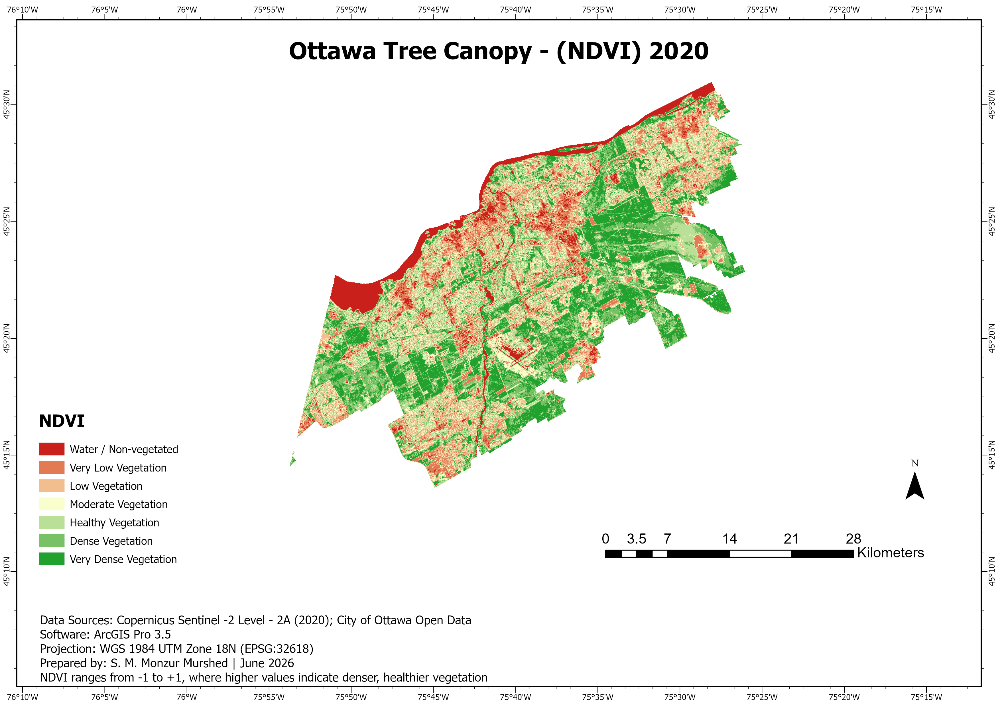
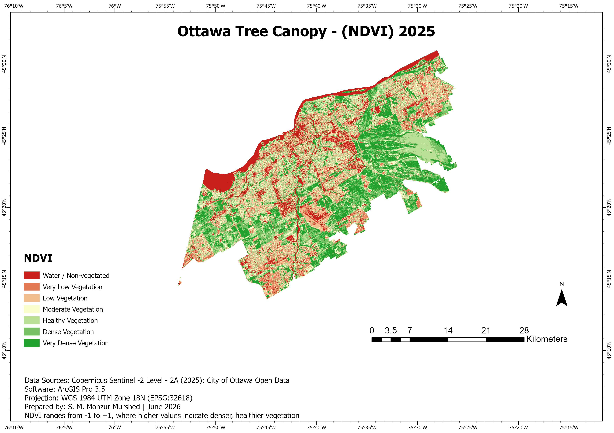
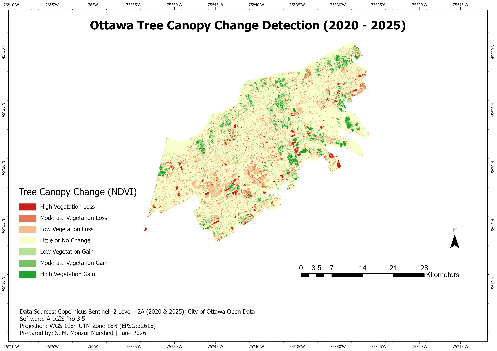

# Ottawa Tree Canopy Change Detection (2020–2025)

## Project Overview

This project analyzes changes in Ottawa's urban tree canopy between 2020 and 2025 using Sentinel-2 satellite imagery and the Normalized Difference Vegetation Index (NDVI). The analysis identifies areas where vegetation increased, decreased, or remained stable over the five-year period.

---

## Objectives

- Calculate NDVI for 2020 and 2025
- Compare vegetation conditions between the two years
- Detect areas of vegetation gain and loss
- Produce professional cartographic layouts
- Automate the workflow using ArcGIS Pro ModelBuilder

---

## Study Area

Ottawa, Ontario, Canada

---

## Data Sources

- Copernicus Sentinel-2 Level-2A (2020 & 2025)
- City of Ottawa Open Data – Urban Boundary

---

## Software

- ArcGIS Pro 3.5
- ModelBuilder
- Raster Calculator
- Spatial Analyst

---

## Methodology

1. Extract B04 (Red) and B08 (Near Infrared) bands.
2. Clip imagery using the Ottawa Urban Boundary.
3. Calculate NDVI using:

   NDVI = (NIR - Red) / (NIR + Red)

4. Calculate NDVI Change:

   NDVI Change = NDVI2025 − NDVI2020

5. Classify vegetation gain and vegetation loss.
6. Produce final cartographic layouts.

---

## Workflow

See the ModelBuilder workflow in the screenshots folder.

---

## Results

The analysis identifies:

- Areas of vegetation gain
- Areas of vegetation loss
- Stable vegetation across Ottawa
- Spatial patterns of urban tree canopy change

---

### NDVI 2020

### NDVI 2025

### Tree Canopy Change Detection

## 

---

## Skills Demonstrated

- Remote Sensing
- NDVI Analysis
- Raster Processing
- ArcGIS Pro
- ModelBuilder
- Spatial Analysis
- Cartographic Design
- Satellite Image Processing

---

## Author

**S. M. Monzur Murshed**

June 2026
